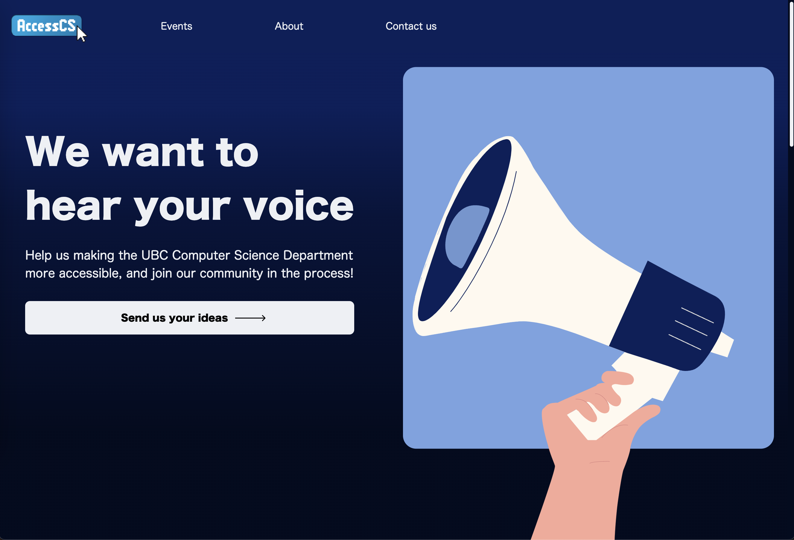

This is the club's official website, built with Vue.js for the frontend and Craft CMS as a headless backend. It provides information about the club, events, members, and more.

## Features
- Dynamic content with Craft CMS
- Responsive design
- Event display and registration
- Contact form

## Technologies Used
- **Frontend:** Vue.js
- **Backend:** Craft CMS (headless mode), AWS S3
- **Styling:** Tailwind CSS
